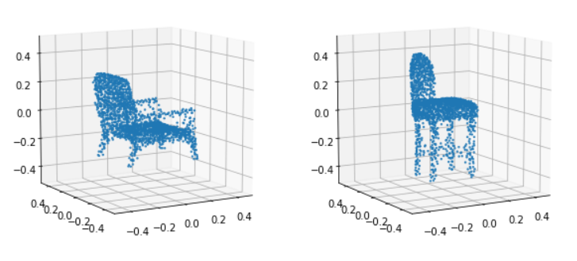
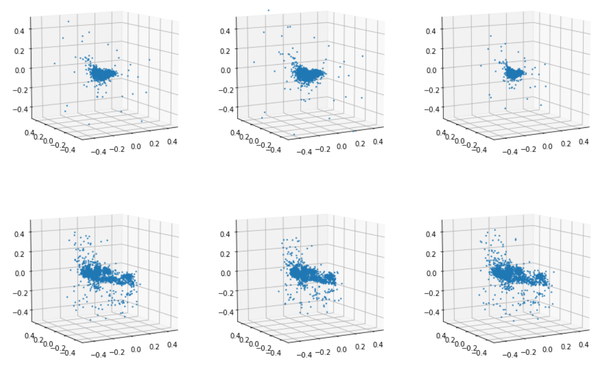
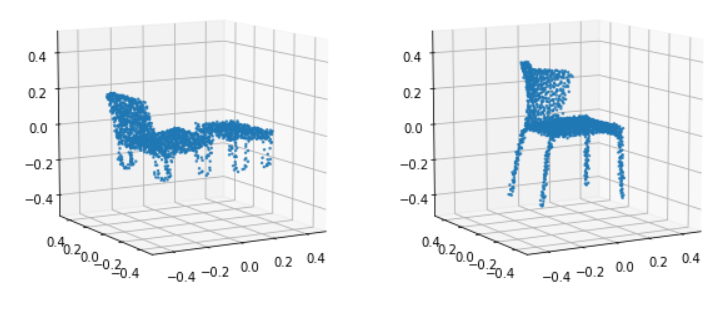

# Learning Representations and Generative Models For 3D Point Clouds 2018ICML
## 原文链接：https://github.com/optas/latent_3d_points
具体内容见Python代码

# 环境
- GPU：RTX 3060Ti（AutoDL云服务器）
- Python = 3.8.10
```
pip install numpy==1.19.5
pip install scipy
pip install tensorflow
pip install tflearn
```

# 下载代码
## 1. 下载代码
```
git clone https://github.com/optas/latent_3d_points
```

## 2. 相关改动
```
cd latent_3d_points/external/structural_losses

将其中的makefile文件前三行改成以下内容：
nvcc = /usr/local/cuda-11.2/bin/nvcc
cudalib =  /usr/local/cuda-11.2/lib64
tensorflow = /home/anaconda3/envs/pcloud/lib/python3.6/site-packages/tensorflow/include
```
```
因为原始代码都是使用python2.7编写，因此需要将其转为python3.x版本的代码
2to3 -w xxx.py
```
```
另外一定要注意jupyter中的文件路径，在src文件夹内的代码中加入以下代码，将代码文件的上一级目录设为项目路径
project_root = os.path.abspath(os.path.join(os.getcwd(), '..'))
sys.path.append(project_root)

另外一定要注意.与..的区别，若读入项目路径外面的文件会报错
```

# 数据集
```
数据地址：https://www.dropbox.com/s/vmsdrae6x5xws1v/shape_net_core_uniform_samples_2048.zip?dl=0
下载解压后将数据集放到latent_3d_points/data/shape_net_core_uniform_samples_2048路径中
```

# 测试
## 1. 训练AE
```
latent_3d_points/notebooks/train_single_class_ae.ipynb
```
## 2. 训练R-GAN
```
latent_3d_points/notebooks/train_raw_gan.ipynb   
```
## 3. 训练L-GAN
```
latent_3d_points/notebooks/train_latent_gan.ipynb
```
## 4. 训练指标
```
latent_3d_points/notebooks/compute_evaluation_metrics.ipynb
```

# 结果
## 1. AE网络重构结果

## 2. R-GAN网络重构结果

## 3. L-GAN网络重构结果

## 评价指标
|MMD|COV|JSD|
|-|-|-|
|0.071|0.73|0.0397|
